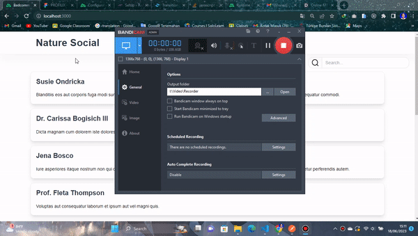
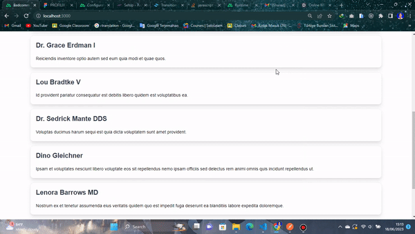
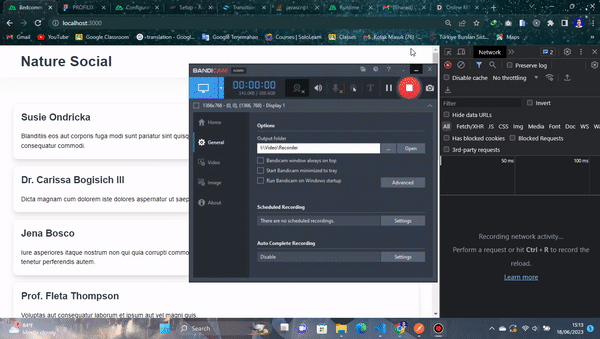
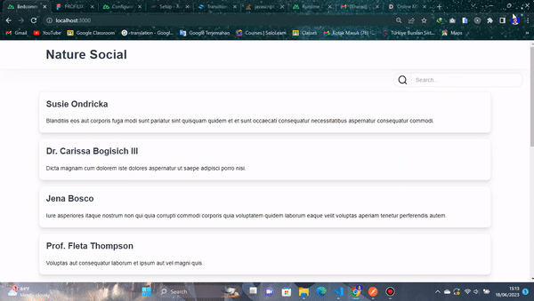

# Usage

First, setup the .env file, then run this command:

```bash
    php artisan migrate:fresh --seed
```

## Features

1. Get Comment Api
2. Get By Params Search
3. Get By Pagination

## Demo

1. Fetch And Loading



2. Load More



3. Use debounce Search, hit api when 1 second keyup



4. Responsive Design


